# Valua — Valibot-Inspired Modular Schema Validation for Lua

> Documentation map: [`docs/README.md`](docs/README.md) · contributor guidance:
> [`AGENTS.md`](AGENTS.md)

**Valua** is a modular, zero-dependency schema validation library for Lua inspired by [Valibot](https://valibot.dev). It brings composable validation actions, structured error reporting, a strictly decomposed module graph, Standard Schema v1 conformance, and an in-memory LuaLS static type compiler to Lua.

The pure-Lua runtime supports Lua 5.1–5.5 and LuaJIT 2.1. Moonstone publishes
one portable source artifact per Valua version; it does not require a separate
Valua release for each Lua ABI. See [runtime compatibility](docs/COMPATIBILITY.md)
and the [benchmark protocol](benchmarks/README.md).

---

## 1. Quick Start

### Installation

```sh
moon add moonstone/valua
```

### Basic Usage

```lua
local v = require("valua")

local UserSchema = v.object({
    name = v.pipe(
        v.string(),
        v.non_empty(),
        v.min_length(2)
    ),
    age = v.integer(),
    role = v.picklist({ "admin", "user" }),
    profile = v.object({
        bio = v.optional(v.string()),
    }),
})

local result = v.safe_parse(UserSchema, {
    name = "Max",
    age = 24,
    role = "admin",
    profile = {},
})

if result.success then
    print("Welcome, " .. result.output.name)
else
    for _, issue in ipairs(result.issues) do
        print("Error at " .. issue.path .. ": " .. issue.message)
    end
end
```

---

## 2. Key Features

- **Valibot-Style Functional Composition:** Modular schemas and actions (`v.pipe(v.string(), v.min_length(3))`).
- **Standard Schema v1 Interoperability:** Every schema implements the `~standard` validation contract (`validate(value, options?) -> { value } | { issues }`).
- **One Primitive Per File Architecture:** Extreme modularity — deep imports (`require("valua.schemas.string")`) work without loading the root namespace.
- **Decoupled Architecture:** One primitive per file, clean dependency boundaries, zero runtime registration, and zero global side effects.
- **Structured Error Pathing:** Issues retain structured paths (`{ { key = "profile" } }`) formatted on demand.
- **LuaLS Automatic Type Inference:** Includes an in-memory AST analyzer and LuaCATS emitter (`tooling/luals/`) that synthesizes IDE class annotations and generic schema bindings without mutating files on disk.

---

## 3. LuaLS IDE Plugin — Automatic Type Inference

Valua includes a language server plugin for [LuaLS](https://github.com/LuaLS/lua-language-server). It analyzes schema declarations in memory and synthesizes precise LuaCATS `---@class` structures and `valua.BaseSchema<I, O>` annotations without modifying files on disk.

> **Note on Environment Paths:** The examples below reference a Moonstone project using Lua 5.4 (`.moonstone/env/share/lua/5.4/`). If your project uses Lua 5.1, LuaJIT, or Lua 5.3, replace `5.4` with your active interpreter version.

### Option 1: Project-level `.luarc.json` (Recommended)

When using Moonstone (`moon add moonstone/valua`), add to your project's `.luarc.json`:

```json
{
  "runtime": {
    "version": "Lua 5.4",
    "plugin": ".moonstone/env/share/lua/5.4/valua/tooling/luals/plugin.lua"
  },
  "workspace": {
    "library": [
      ".moonstone/env/share/lua/5.4"
    ]
  }
}
```

### Option 2: Neovim (`nvim-lspconfig`)

```lua
require("lspconfig").lua_ls.setup({
  settings = {
    Lua = {
      runtime = {
        version = "Lua 5.4",
        plugin = vim.fn.getcwd() .. "/.moonstone/env/share/lua/5.4/valua/tooling/luals/plugin.lua",
      },
      workspace = {
        library = {
          vim.fn.getcwd() .. "/.moonstone/env/share/lua/5.4",
        },
      },
    },
  },
})
```

### Option 3: VS Code (`.vscode/settings.json`)

```json
{
  "Lua.runtime.version": "Lua 5.4",
  "Lua.runtime.plugin": ".moonstone/env/share/lua/5.4/valua/tooling/luals/plugin.lua",
  "Lua.workspace.library": [
    "${workspaceFolder}/.moonstone/env/share/lua/5.4"
  ]
}
```

---

## 4. Standard Schema v1 Interoperability

Valua implements the [Standard Schema v1](https://standardschema.dev) interface for ecosystem-wide validator interoperability:

```lua
local standard = UserSchema["~standard"]
assert(standard.version == 1)
assert(standard.vendor == "valua")

local res = standard.validate(payload)
if res.issues then
    for _, issue in ipairs(res.issues) do
        print(issue.message)
    end
else
    print("User authenticated:", res.value.name)
end
```

---

## 5. Architecture & Type System

Valua keeps value-producing work in Lua APIs and offers two equivalent ways to
declare tooling metadata. `v.alias(name, schema)` is the canonical ordinary-Lua
form because it works across editors; `---@valua-alias Name Schema` is an
optional zero-runtime shorthand for tooling-first codebases. Standard Schema
interoperability and deep modular exports remain runtime concerns.

```mermaid
flowchart TD
    schema["v.object({ ... })"] --> analyzer["Valua Schema AST Analyzer"]
    analyzer --> type_ir["Type Intermediate Representation (IR)"]
    type_ir --> cats["LuaCATS Synthetic Classes"]
    cats --> base_schema["BaseSchema<Input, Output>"]
    base_schema --> luals["LuaLS Generic Propagation"]
    luals --> parse["v.parse() → Output"]
    luals --> safe_parse["v.safe_parse() → SafeParseResult<Output>"]

    classDef source fill:#1d4ed8,stroke:#93c5fd,color:#eff6ff
    classDef plan fill:#7c3aed,stroke:#c4b5fd,color:#f5f3ff
    classDef product fill:#047857,stroke:#6ee7b7,color:#ecfdf5
    classDef effect fill:#b45309,stroke:#fcd34d,color:#fffbeb
    class schema source
    class analyzer,type_ir plan
    class cats,base_schema product
    class luals,parse,safe_parse effect
```



- **Runtime Execution:** Pure Lua tables and closures with zero global state. `v.assume` remains an identity function because it participates in value flow. `v.alias` returns its schema unchanged and has negligible runtime cost.
- **Alias Declarations:** `v.alias("User", UserSchema)` is the canonical, discoverable form. A Valua-aware production optimizer may erase this standalone identity call; `---@valua-alias User UserSchema` is the equivalent comment shorthand.
- **Type Propagation:** `v.safe_parse` produces `valua.SafeParseResult<O>`: success has `success = true` and `output = O`; failure has `success = false` and `issues = Issue[]`. `v.parse` returns non-nullable `O` directly.
- **Zero-Copy Standard Schema:** Native issues already satisfy the `{ message, path = { { key } } }` contract, enabling zero-copy standard validation results.

---

## 6. Decoupled Module Architecture & Deep Imports

Valua's dependency graph is architecturally decomposed: every primitive lives in its own file with minimal core dependencies and zero global side effects. You can import individual primitives directly without loading the root module table, making codebases clean and keeping future module bundling and dead-code elimination straightforward:

```lua
local string = require("valua.schemas.string")
local min_length = require("valua.actions.min_length")
local pipe = require("valua.methods.pipe")
local parse = require("valua.methods.parse")

local schema = pipe(string(), min_length(3))
local value = parse(schema, "hello")
```

---

## 7. Available Primitives

### Schemas
`any`, `unknown`, `never`, `nil_`, `boolean`, `number`, `integer`, `string`, `literal`, `picklist`, `array`, `tuple`, `object`, `loose_object`, `strict_object`, `record`, `union`, `optional`, `lazy`, `custom`.

### Actions & Pipelines
- `v.non_empty()`, `v.length(n)`, `v.min_length(n)`, `v.max_length(n)`
- `v.min_value(n)`, `v.max_value(n)`, `v.multiple_of(n)`
- `v.starts_with(str)`, `v.ends_with(str)`, `v.pattern(lua_pattern)`
- `v.check(predicate, message)`: Custom validation rule.
- `v.transform(fn)`: Transforms parsed values into a new output representation (e.g. `v.pipe(v.string(), v.transform(tonumber))` $\rightarrow$ `BaseSchema<string, number>`).

### Methods
- `v.pipe(schema, ...actions)`: Composes a base schema with validation/transformation stages.
- `v.parse(schema, input, opts?)`: Parses and validates input, throwing `ValidationError` on failure.
- `v.safe_parse(schema, input, opts?)`: Parses input returning `{ success = true, output = val }` or `{ success = false, issues = [...] }`.
- `v.safe_parse(schema, input, { abort_early = true })`: Stops after the first issue when complete diagnostics are unnecessary.
- `v.is(schema, input)`: Fast boolean check.
- `v.alias(name, schema)`: Declares a reusable LuaLS output alias and returns `schema` unchanged.
- `v.assume(schema, value)`: Unchecked type assertion returning `value` typed as the schema output type without runtime validation.

---

## 8. Static Typing Helpers (`v.alias` & `v.assume`)

Valua provides two explicit helpers to bridge runtime schemas with static annotations:

```lua
local UserSchema = v.object({
    name = v.string(),
    age = v.integer(),
})

-- 1. Reusable Type Alias (canonical, ordinary Lua)
v.alias("User", UserSchema)

-- `v.safe_parse(UserSchema, value)` is synthesized as
-- `valua.SafeParseResult<User>` by the LuaLS plugin.
-- Inside `if result.success`, `result.output` is a non-optional User.

`v.alias(Name, Schema)` has no validation semantics: it returns the exact same
schema and is deliberately written as a standalone declaration. A future
Valua-aware optimizer can erase that statement trivially. If a codebase prefers
comment-only metadata, `---@valua-alias Name Schema` is an equivalent optional
tooling shorthand and has zero runtime cost.

---@param user User
local function greet(user)
    print(user.name)
end

-- 2. Unchecked Type Assertion
-- Asserts that an existing runtime value satisfies the schema output type without validation.
local trusted_user = v.assume(UserSchema, cache:get("user"))
```

> **Warning on `v.assume`:** `v.assume` performs **zero runtime validation or transformation** (identity cost). It is designed strictly for trusted/internal boundaries. Use `v.parse` or `v.safe_parse` for untrusted inputs.

---

## 9. Testing & Benchmarking

Run tests:
```bash
moon exec lua tests/runner.lua
```

Run benchmarks:
```bash
moon exec lua benchmarks/bench.lua
```
