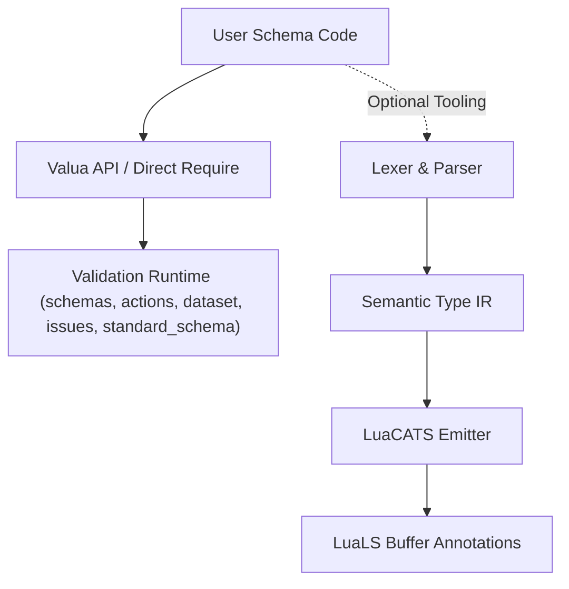

# Valua — Valibot-Inspired Modular Schema Validation for Lua

**Valua** is a modular, zero-dependency schema validation library for Lua inspired by [Valibot](https://valibot.dev). It brings composable validation actions, structured error reporting, extreme tree-shaking readiness, Standard Schema v1 conformance, and an optional LuaLS static type compiler to Lua.

---

## 1. Quick Start

```lua
local v = require("valua")

local UserSchema = v.object({
    name = v.pipe(
        v.string(),
        v.non_empty(),
        v.min_length(2)
    ),
    age = v.integer(),
    role = v.picklist({ "admin", "user" }),
    profile = v.object({
        bio = v.optional(v.string()),
    }),
})

local result = v.safe_parse(UserSchema, {
    name = "Max",
    age = 24,
    role = "admin",
    profile = {},
})

if result.success then
    print("Welcome, " .. result.output.name)
else
    for _, issue in ipairs(result.issues) do
        print("Error at " .. issue.path_str .. ": " .. issue.message)
    end
end
```

---

## 2. Key Features

- **Valibot-Style Functional Composition:** Modular schemas and actions (`v.pipe(v.string(), v.min_length(3))`).
- **Standard Schema v1 Interoperability:** Every schema implements the `~standard` validation contract (`validate(value, options?) -> { value } | { issues }`).
- **One Primitive Per File Architecture:** Extreme modularity — deep imports (`require("valua.schemas.string")`) work without loading the root namespace.
- **Tree-Shaker Ready:** Static imports, no runtime registration, zero global side effects.
- **Structured Error Pathing:** Issues retain structured paths (`{ { key = "profile" } }`) formatted on demand.
- **LuaLS Type Compiler Bridge:** Includes an analyzer and LuaCATS emitter (`tooling/luals/`) that transforms schema expressions into static IDE annotations without mutating source files on disk.

---

## 3. Standard Schema v1 Interoperability

Valua implements the [Standard Schema v1](https://standardschema.dev) interface for ecosystem-wide validator interoperability:

```lua
local standard = UserSchema["~standard"]
assert(standard.version == 1)
assert(standard.vendor == "valua")

local res = standard.validate(payload)
if res.issues then
    for _, issue in ipairs(res.issues) do
        print(issue.message)
    end
else
    print("User authenticated:", res.value.name)
end
```

---

## 4. Architecture Overview



---

## 5. Deep Imports (Tree-Shaking Friendly)

You can import primitives individually without touching the `valua` root module:

```lua
local string = require("valua.schemas.string")
local min_length = require("valua.actions.min_length")
local pipe = require("valua.methods.pipe")
local parse = require("valua.methods.parse")

local schema = pipe(string(), min_length(3))
local value = parse(schema, "hello")
```

---

## 6. Available Primitives

### Schemas
`any`, `unknown`, `never`, `nil_`, `boolean`, `number`, `integer`, `string`, `literal`, `picklist`, `array`, `tuple`, `object`, `loose_object`, `strict_object`, `record`, `union`, `optional`, `lazy`, `custom`.

### Actions
`check`, `transform`, `non_empty`, `length`, `min_length`, `max_length`, `min_value`, `max_value`, `multiple_of`, `pattern`, `starts_with`, `ends_with`.

### Methods
`pipe`, `parse`, `safe_parse`, `is`.

---

## 7. Testing & Benchmarking

Run tests:
```bash
moon exec lua tests/runner.lua
```

Run benchmarks:
```bash
moon exec lua benchmarks/bench.lua
```
