# Valua

Valua is a deterministic schema declaration, runtime validation, and static type inference library for Lua and Moonstone projects. It combines composable runtime validation with full LuaLS language server autocompletion and discriminated union narrowing.

---

## 1. Quick Start

### Install

Add Valua to your Moonstone project:

```sh
moon add moonstone/valua
```

### Define a Schema and Validate

```lua
local v = require("valua")

-- Define schema
local UserSchema = v.object({
  id = v.integer(),
  username = v.pipe(v.string(), v.non_empty(), v.min_length(3), v.max_length(32)),
  role = v.picklist({ "admin", "member", "guest" }),
  profile = v.object({
    display_name = v.string(),
    biography = v.optional(v.string()),
  }),
})

-- Parse untrusted input safely
local payload = {
  id = 101,
  username = "max_dev",
  role = "admin",
  profile = {
    display_name = "Max Power",
  },
}

local result = v.safe_parse(UserSchema, payload)

if result.success then
  -- Fully typed and autocompleted in Neovim/LuaLS!
  print("Welcome, " .. result.output.profile.display_name)
else
  for _, issue in ipairs(result.issues) do
    print(string.format("Validation error at %s: %s", issue.path_str, issue.message))
  end
end
```

---

## 2. Architecture & LuaLS Type Inference

Valua bridges runtime validation with the Lua Language Server (LuaLS) without requiring call-site type assertions.

```mermaid
flowchart TD
  subgraph User Code
    schema["v.object({ ... })"] --> parse["v.safe_parse(Schema, input)"]
  end

  subgraph Valua LuaLS Engine
    schema -->|analyze| type_ir["Type IR"]
    type_ir -->|synthesize| cats["LuaCATS ---@class definitions"]
    cats -->|attach| base_schema["BaseSchema<Input, Output>"]
  end

  subgraph LuaLS Runtime
    base_schema --> luals_engine["LuaLS Type Checker"]
    parse --> luals_engine
    luals_engine -->|discriminated union| result["SafeParseSuccess<Output> | SafeParseError"]
    result -->|if result.success| ide["Full IDE Autocompletion & Hover"]
  end

  classDef source fill:#1d4ed8,stroke:#93c5fd,color:#eff6ff
  classDef plan fill:#7c3aed,stroke:#c4b5fd,color:#f5f3ff
  classDef product fill:#047857,stroke:#6ee7b7,color:#ecfdf5
  classDef effect fill:#b45309,stroke:#fcd34d,color:#fffbeb
  class schema,parse source
  class type_ir,cats,base_schema plan
  class result,luals_engine product
  class ide effect
```



---

## 3. Core Capabilities

### Primitive Schemas
- `v.string()`, `v.number()`, `v.integer()`, `v.boolean()`
- `v.nil_()`, `v.any()`, `v.unknown()`, `v.never()`
- `v.literal(val)`, `v.picklist({ "a", "b", "c" })`

### Structural & Complex Combinators
- `v.object({ ... })`: Strips unknown keys deterministically.
- `v.strict_object({ ... })`: Rejects unknown keys with validation errors.
- `v.loose_object({ ... })`: Preserves extra undeclared keys.
- `v.record(key_schema, value_schema)`: Dynamic key-value mappings.
- `v.array(item_schema)`: Typed lists.
- `v.tuple({ item1, item2 })`: Fixed-length positional tuples.
- `v.union({ s1, s2 })`: Discriminated and structural unions.
- `v.optional(schema)`: Permissive `T | nil`.
- `v.lazy(function() return Schema end)`: Recursive schemas.
- `v.custom(predicate, message)`: Custom validation functions.

### Actions & Pipelines
Combine validations using `v.pipe(...)`:
```lua
local EmailSchema = v.pipe(
  v.string(),
  v.non_empty(),
  v.min_length(5),
  v.max_length(255),
  v.pattern("^[%w._%%+-]+@[%w.-]+%.%a%a+$")
)
```

Available actions:
- `v.non_empty()`, `v.length(n)`, `v.min_length(n)`, `v.max_length(n)`
- `v.min_value(n)`, `v.max_value(n)`, `v.multiple_of(n)`
- `v.starts_with(str)`, `v.ends_with(str)`, `v.pattern(lua_pattern)`
- `v.transform(fn)`: Mutate or sanitize parsed values.

---

## 4. Methods

| Method | Signature | Description |
| :--- | :--- | :--- |
| `v.safe_parse(schema, input, opts?)` | `SafeParseResult<O>` | Returns `{ success = true, output = val }` or `{ success = false, issues = [...] }`. Never throws. |
| `v.parse(schema, input, opts?)` | `O` | Returns parsed value or throws a structured `ValidationError`. |
| `v.is(schema, input)` | `boolean` | Fast boolean check. Aborts on first issue. |
| `v.pipe(schema, ...actions)` | `BaseSchema<I, O>` | Composes a base schema with validation/transformation stages. |

---

## 5. Tree-Shakable Modular Imports

Valua is architected for modularity. You can import individual primitives without loading the root table:

```lua
local string = require("valua.schemas.string")
local parse = require("valua.methods.parse")
local min_length = require("valua.actions.min_length")
local pipe = require("valua.methods.pipe")

local ShortString = pipe(string(), min_length(3))
local value = parse(ShortString, "hello")
```
