# Valua

Valua is a deterministic schema declaration, runtime validation, and static type inference library for Lua and Moonstone projects. It combines composable runtime validation with full LuaLS language server autocompletion, concrete schema output inference, and Standard Schema v1 interoperability.

---

## 1. Quick Start

### Install

Add Valua to your Moonstone project:

```sh
moon add moonstone/valua
```

### Define a Schema and Validate

```lua
local v = require("valua")

-- Define schema
local UserSchema = v.object({
  id = v.integer(),
  username = v.pipe(v.string(), v.non_empty(), v.min_length(3), v.max_length(32)),
  role = v.picklist({ "admin", "member", "guest" }),
  profile = v.object({
    display_name = v.string(),
    biography = v.optional(v.string()),
  }),
})

-- Parse untrusted input safely
local payload = {
  id = 101,
  username = "max_dev",
  role = "admin",
  profile = {
    display_name = "Max Power",
  },
}

local result = v.safe_parse(UserSchema, payload)

if result.success then
  -- Fully typed and autocompleted in Neovim/LuaLS!
  print("Welcome, " .. result.output.profile.display_name)
else
  for _, issue in ipairs(result.issues) do
    print("Error at " .. issue.path .. ": " .. issue.message)
  end
end
```

---

## 2. LuaLS IDE Plugin — Automatic Type Inference

Valua includes a first-class language server plugin for [LuaLS](https://github.com/LuaLS/lua-language-server). The plugin analyzes schema definitions in memory and synthesizes exact LuaCATS `---@class` structures and `valua.BaseSchema<I, O>` annotations without modifying your source code on disk.

> **Note on Environment Paths:** The examples below reference a Moonstone project using Lua 5.4 (`.moonstone/env/share/lua/5.4/`). If your project uses Lua 5.1, LuaJIT, or Lua 5.3, replace `5.4` with your active interpreter version.

### Option 1: Project-level `.luarc.json` (Recommended)

When Valua is installed via Moonstone (`moon add moonstone/valua`), configure `.luarc.json` in your project root:

```json
{
  "runtime": {
    "version": "Lua 5.4",
    "plugin": ".moonstone/env/share/lua/5.4/valua/tooling/luals/plugin.lua"
  },
  "workspace": {
    "library": [
      ".moonstone/env/share/lua/5.4"
    ]
  }
}
```

### Option 2: Neovim (`nvim-lspconfig`)

In your Neovim LSP setup:

```lua
require("lspconfig").lua_ls.setup({
  settings = {
    Lua = {
      runtime = {
        version = "Lua 5.4",
        plugin = vim.fn.getcwd() .. "/.moonstone/env/share/lua/5.4/valua/tooling/luals/plugin.lua",
      },
      workspace = {
        library = {
          vim.fn.getcwd() .. "/.moonstone/env/share/lua/5.4",
        },
      },
    },
  },
})
```

### Option 3: VS Code (`.vscode/settings.json`)

```json
{
  "Lua.runtime.version": "Lua 5.4",
  "Lua.runtime.plugin": ".moonstone/env/share/lua/5.4/valua/tooling/luals/plugin.lua",
  "Lua.workspace.library": [
    "${workspaceFolder}/.moonstone/env/share/lua/5.4"
  ]
}
```

---

## 3. Architecture & LuaLS Type Inference

Valua bridges runtime validation with the Lua Language Server (LuaLS) without requiring call-site type assertions.

```mermaid
flowchart TD
  schema["v.object({ ... })"] --> analyzer["Valua Schema AST Analyzer"]
  analyzer --> type_ir["Type Intermediate Representation (IR)"]
  type_ir --> cats["LuaCATS Synthetic Classes"]
  cats --> base_schema["BaseSchema<Input, Output>"]
  base_schema --> luals["LuaLS Generic Propagation"]
  luals --> parse["v.parse() → Output"]
  luals --> safe_parse["v.safe_parse() → SafeParseResult<Output>"]

  classDef source fill:#1d4ed8,stroke:#93c5fd,color:#eff6ff
  classDef plan fill:#7c3aed,stroke:#c4b5fd,color:#f5f3ff
  classDef product fill:#047857,stroke:#6ee7b7,color:#ecfdf5
  classDef effect fill:#b45309,stroke:#fcd34d,color:#fffbeb
  class schema source
  class analyzer,type_ir plan
  class cats,base_schema product
  class luals,parse,safe_parse effect
```



- **In-Memory AST Lowering:** The language server plugin reads AST declarations and materializes hierarchical LuaCATS definitions matching the exact structure of your schemas.
- **Unified Result Model:** `v.safe_parse` yields `valua.SafeParseResult<O>` (`{ success: boolean, output?: O, issues?: Issue[] }`), providing instant autocomplete and hover across every control-flow branch.
- **Direct Extraction:** `v.parse` returns `O` non-nullable directly, throwing structured `ValidationError` on failure.

---

## 4. Standard Schema v1 Interoperability

Valua implements the **Standard Schema v1 validation contract** for Lua (`https://standardschema.dev`). Every Valua schema exposes the `~standard` property with a synchronous `validate(value, options?)` method:

```lua
local v = require("valua")

local User = v.object({
  name = v.string(),
})

-- Interoperability boundary
local result = User["~standard"].validate(payload)

if result.issues then
  for _, issue in ipairs(result.issues) do
    print(issue.message)
  end
else
  print("Validated user:", result.value.name)
end
```

> **Note:** Ordinary Valua users will usually prefer `v.safe_parse(...)` for formatted error paths. The `~standard` interface is primarily designed for third-party routers, form libraries, and frameworks that accept arbitrary Standard Schema-compliant validators without hard-depending on Valua.

---

## 5. Core Capabilities

### Primitive Schemas
- `v.string()`, `v.number()`, `v.integer()`, `v.boolean()`
- `v.nil_()`, `v.any()`, `v.unknown()`, `v.never()`
- `v.literal(val)`, `v.picklist({ "a", "b", "c" })`

### Structural & Complex Combinators
- `v.object({ ... })`: Strips unknown keys deterministically.
- `v.strict_object({ ... })`: Rejects unknown keys with validation errors.
- `v.loose_object({ ... })`: Preserves extra undeclared keys.
- `v.record(key_schema, value_schema)`: Dynamic key-value mappings.
- `v.array(item_schema)`: Typed lists.
- `v.tuple({ item1, item2 })`: Fixed-length positional tuples.
- `v.union({ s1, s2 })`: Structural unions.
- `v.optional(schema)`: Permissive `T | nil`.
- `v.lazy(function() return Schema end)`: Recursive schemas.
- `v.custom(predicate, message)`: Custom validation functions.

### Actions & Pipelines
Combine validations using `v.pipe(...)`:
```lua
local EmailSchema = v.pipe(
  v.string(),
  v.non_empty(),
  v.min_length(5),
  v.max_length(255),
  v.pattern("^[%w._%%+-]+@[%w.-]+%.%a%a+$")
)
```

Available actions:
- `v.non_empty()`, `v.length(n)`, `v.min_length(n)`, `v.max_length(n)`
- `v.min_value(n)`, `v.max_value(n)`, `v.multiple_of(n)`
- `v.starts_with(str)`, `v.ends_with(str)`, `v.pattern(lua_pattern)`
- `v.check(predicate, message)`: Custom predicate validation.
- `v.transform(fn)`: Transforms parsed values into a new output representation (e.g. `v.pipe(v.string(), v.transform(tonumber))` $\rightarrow$ `BaseSchema<string, number>`).

---

## 6. Methods

| Method | Signature | Description |
| :--- | :--- | :--- |
| `v.safe_parse(schema, input, opts?)` | `SafeParseResult<O>` | Returns `{ success = true, output = val }` or `{ success = false, issues = [...] }`. Never throws. |
| `v.parse(schema, input, opts?)` | `O` | Returns parsed value or throws a structured `ValidationError`. |
| `v.is(schema, input)` | `boolean` | Fast boolean check. Aborts on first issue. |
| `v.pipe(schema, ...actions)` | `BaseSchema<I, O>` | Composes a base schema with validation/transformation stages. |
| `v.alias(name, schema)` | `BaseSchema<I, O>` | Assigns a reusable LuaCATS alias for the schema's output type. |
| `v.assume(schema, value)` | `O` | Unchecked type assertion returning `value` typed as schema output type without validation. |

---

## 7. Static Typing Helpers (`v.alias` & `v.assume`)

```lua
local UserSchema = v.object({
  id = v.integer(),
  name = v.string(),
  profile = v.object({ bio = v.optional(v.string()) }),
})

-- Reusable type alias
v.alias("User", UserSchema)

---@param user User
local function greet(user)
  print(user.name)
end

-- Unchecked type assertion for known/cached values
local cached_user = v.assume(UserSchema, cache:get("user"))
```

> **Warning on `v.assume`:** `v.assume` performs **zero runtime validation or transformation** (identity cost). Use `v.parse` or `v.safe_parse` for untrusted values.

---

## 8. Decoupled Module Architecture & Deep Imports

Valua's dependency graph is architecturally decomposed: every primitive lives in its own file with minimal core dependencies and zero global side effects. You can import individual primitives directly without loading the root module table, making codebases clean and keeping future module bundling and dead-code elimination straightforward:

```lua
local string = require("valua.schemas.string")
local parse = require("valua.methods.parse")
local min_length = require("valua.actions.min_length")
local pipe = require("valua.methods.pipe")

local ShortString = pipe(string(), min_length(3))
local value = parse(ShortString, "hello")
```
