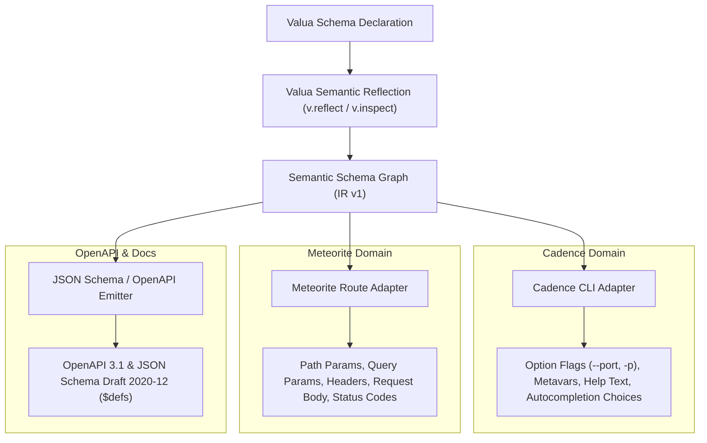

# Valua Semantic Schema Graph & Reflection IR: Architecture & Design Specification

## 1. Problem Statement & Design Objectives

Valua was initially built as an execution-oriented validation library with Standard Schema v1 compliance and LuaLS static type synthesis. However, downstream consumers in the Moonstone ecosystem need to inspect schema structure:

1. **Cadence** needs to derive CLI argument types, help texts, autocompletions (from picklists/literals), and value coercions without writing redundant metadata.
2. **Meteorite** needs to project input/output validation schemas into HTTP route graphs and OpenAPI 3.1 specifications without maintaining a parallel schema DSL.
3. **Tooling & Generators** need to produce JSON Schema, documentation, test mocks, and interface bindings from a single authoritative source of value semantics.

### Invariants
* **Valua is a validator first**: Schema reflection and metadata features must never penalize ordinary validation speed or memory consumption.
* **Separation of Concerns**: Valua models **value semantics** only. It does not learn CLI grammar (flags, short options, argv tokenization) or HTTP semantics (methods, route paths, status codes).
* **Encapsulation**: Consumers interact with normalized, versioned semantic nodes (`valua.SchemaNode`, `valua.SchemaGraph`) rather than private implementation tables (`_run`, `item_schema`, `pipe_stages`).

---

## 2. Public vs. Private Boundary & Reflection API

The reflection architecture establishes a strict boundary between private runtime validation structures and public semantic projections:

```text
+-------------------------------------------------------------+
|               Private Validation Implementation              |
|   (table: _run, ["~standard"], entries, pipe_stages, ...)   |
+------------------------------+------------------------------+
                               |
                               v
+-------------------------------------------------------------+
|                 Normalization & Reflection Layer             |
|       (v.reflect, v.inspect, v.walk, v.to_json_schema)      |
+------------------------------+------------------------------+
                               |
                               v
+-------------------------------------------------------------+
|                 Public Semantic IR (Version 1)               |
|      (SchemaGraph, SchemaNode, Constraint, PipelineStage)   |
+-------------------------------------------------------------+
```

### 2.1 Core API Functions

#### `v.inspect(schema) -> valua.SchemaNode`
Extracts a normalized, self-contained semantic node for a schema without requiring manual graph traversal for simple leaf and composite structures.

#### `v.reflect(schema, options?) -> valua.SchemaGraph`
Constructs a complete semantic graph with deterministic node identifiers (`n1`, `n2`, etc.), resolving shared schema references and circular dependencies safely.

#### `v.walk(target, visitor, options?)`
Provides low-allocation, streaming traversal over a schema or `SchemaGraph`. The visitor can implement callback hooks (`enter_node`, `leave_node`, `primitive`, `object`, `array`, `pipe`, `reference`).

#### `v.annotate(schema, metadata) -> schema`
Attaches documentation and namespaced annotations immutably to a schema. Convenience shorthands include `v.describe`, `v.title`, `v.deprecated`, `v.examples`, and `v.default`.

#### `v.to_json_schema(schema, options?) -> table`
Projects a Valua schema or `SchemaGraph` into standard JSON Schema Draft 2020-12 / OpenAPI 3.1 representations, emitting `$defs` for reusable and recursive nodes.

---

## 3. Semantic Node Vocabulary

```lua
---@class valua.SchemaGraph
---@field format "valua.schema-graph.v1"
---@field root string
---@field nodes table<string, valua.SchemaNode>

---@class valua.SchemaNode
---@field id string
---@field kind string
---@field value? any
---@field options? (string|number)[]
---@field entries? table<string, valua.ObjectEntryDescriptor>
---@field entry_order? string[]
---@field strict? boolean
---@field loose? boolean
---@field element? string
---@field elements? string[]
---@field key? string
---@field variants? string[]
---@field wrapped? string
---@field base? string
---@field constraints? valua.Constraint[]
---@field stages? valua.PipelineStage[]
---@field has_transform? boolean
---@field opaque? boolean
---@field message? string
---@field metadata? valua.Metadata
```

### 3.1 Node Classification

* **Primitives**: `string`, `number`, `integer`, `boolean`, `nil`, `any`, `unknown`, `never`.
* **Constants & Enums**: `literal` (`.value`), `picklist` (`.options`).
* **Composites**:
  * `object`, `loose_object`, `strict_object`: `.entries` dictionary + `.entry_order` array.
  * `array`: `.element` (child node ID).
  * `tuple`: `.elements` (array of child node IDs).
  * `record`: `.key` and `.value` (child node IDs).
  * `union`: `.variants` (array of child node IDs).
  * `optional`: `.wrapped` (child node ID).
  * `lazy`: evaluated safely with cycle detection, pointing `.wrapped` to the target node ID.
* **Pipelines (`pipe`)**:
  * `.base`: child node ID representing the underlying input schema.
  * `.constraints`: array of structural constraint descriptors (`min_value`, `max_value`, `min_length`, `max_length`, `length`, `non_empty`, `multiple_of`, `pattern`, `starts_with`, `ends_with`).
  * `.stages`: full sequence of pipeline stages.
  * `.has_transform`: boolean indicating if output value differs from input type.
* **Opaque Nodes**: `custom` schemas and arbitrary `check`/`transform` closures have `opaque = true`. They are never falsified as pure structural constraints.

---

## 4. Metadata Model & Identity Architecture

### 4.1 Four Tiers of Schema Identity

To prevent semantic confusion between runtime pointers, serialization identifiers, and contextual wrappers, Valua distinguishes four tiers of identity:

1. **Runtime Schema Identity (Lua Table Pointers)**:
   In-memory table references. Used internally by the reflection engine to detect graph node reuse and cycle recursion.
2. **Graph-Local Node Identity (`n1`, `n2`, ...)**:
   Topologically deterministic IDs assigned during graph traversal. They are transient and specific to a single `v.reflect()` execution.
3. **Explicit Semantic Identity (`metadata.id`)**:
   Durable identifiers explicitly declared by domain authors (e.g., `{ id = "Address" }`). When present, the reflected node receives this ID. If duplicate semantic IDs exist within the same graph, Valua disambiguates them deterministically (`"Item"`, `"Item_2"`) rather than silently colliding.
4. **Contextual / Edge Identity (Annotation Wrappers)**:
   Created via `v.describe(Schema, "...")` or `v.annotate(Schema, ...)`. When an object entry wraps a canonical schema with field-specific metadata, the graph registers a single canonical node in `graph.nodes` while attaching the contextual metadata to the object's entry descriptor (`entries[key].metadata`).

```lua
local Email = v.annotate(v.pipe(
    v.string(),
    v.non_empty()
), {
    id = "Email",
    description = "Canonical email address",
})

local User = v.object({
    billing_email = v.describe(Email, "Address used for billing notifications"),
    support_email = v.describe(Email, "Address support staff should contact"),
})

-- g.nodes contains exactly one node for 'Email'
-- entries.billing_email.node == "Email", with entry metadata for billing
-- entries.support_email.node == "Email", with entry metadata for support
```

### 4.2 Rejection of Constructor Options
Adding an `opts?` argument to every primitive constructor (`v.string({ description = "..." })`) was rejected because:
1. It adds table allocation and branch overhead during high-frequency schema instantiation.
2. It interferes with existing `custom_message` string parameters.
3. It degrades LuaLS generic type inference and makes editor autocomplete noisy.

### 4.3 Approved Annotation Model (`v.annotate`)
Metadata is attached via `v.annotate` (or shorthands `v.describe`, `v.title`, `v.deprecated`, `v.examples`):

```lua
local Port = v.annotate(v.pipe(
    v.integer(),
    v.min_value(1),
    v.max_value(65535)
), {
    id = "Port",
    title = "Network Port",
    description = "TCP/UDP listening port",
    default = 8080,
    examples = { 80, 443, 8080 },
    annotations = {
        cadence = { short = "p", metavar = "PORT" },
        meteorite = { location = "header", header = "X-Port" },
    },
})
```

### 4.4 Metadata Merging & Namespace Rules
When chaining annotations (`v.annotate(v.annotate(schema, meta1), meta2)`):
* **Scalars & Arrays**: Replaced by subsequent annotations (`title`, `description`, `deprecated`, `default`, `examples`).
* **Namespaced Annotations (`metadata.annotations`)**: Merged per-namespace. Keys within an existing namespace are overwritten while preserving sibling keys (e.g. `cadence.short` can be updated while preserving `cadence.metavar`).
* **Namespace Opacity**: Valua treats all custom namespaces as opaque payloads, storing and reflecting them without alteration.

### 4.5 Default Semantics & Future `v.default` Primitive
* `metadata.default` is strictly **descriptive metadata**. It does not modify runtime parsing or turn missing (`nil`) inputs into values.
* The shorthand `v.default` has been removed from the metadata API to avoid semantic ambiguity and is reserved for a future runtime coercion schema primitive (`v.default(schema, fallback_value)`).

---

## 5. Consumer Integration Boundaries



### 5.1 Cadence Integration Boundary
Cadence reads:
* `node.kind` &rarr; Argument value parser (string, integer, boolean).
* `node.options` (from picklist) &rarr; Shell completion candidates (Bash, Zsh, Fish).
* `node.constraints` (`min_value`, `max_value`) &rarr; Range validation and help documentation.
* `node.metadata.description` &rarr; CLI `--help` option description.
* `node.metadata.default` &rarr; Default option values.

Cadence owns:
* Option names (`--port`), short aliases (`-p`), positional arguments, `--` pass-through delimiters, command subtrees, and execution handlers.

### 5.2 Meteorite Integration Boundary
Meteorite reads:
* Object properties &rarr; Request/response validation schemas.
* Constraints & format patterns &rarr; OpenAPI schema parameter constraints (`minLength`, `pattern`, `minimum`).
* `v.to_json_schema(schema)` &rarr; Route OpenAPI component schema.

Meteorite owns:
* HTTP methods (GET, POST, etc.), URI route templates (`/users/:id`), query vs header vs path placement, HTTP response status codes (200, 400, 404), and authentication scopes.

---

## 6. Performance Audit Findings

Benchmarking against 100,000 operations per schema type verified that adding the reflection and metadata foundation introduced **0% overhead on validation**:

```text
Benchmark Task                         Median Duration       Operations / Second
---------------------------------------------------------------------------------
flat_success                           0.0759 s              658,345 ops/s
nested_success                         0.1213 s              412,174 ops/s
pipeline_success                       0.0294 s            1,700,622 ops/s
primitive_failure                      0.0610 s              819,578 ops/s
three_issue_failure                    0.2153 s              232,153 ops/s
array_success                          0.1005 s              497,418 ops/s
tuple_success                          0.0745 s              670,367 ops/s
loose_object_success                   0.0562 s              889,521 ops/s
is_object_failure                      0.0620 s              806,140 ops/s
```

All standard schemas bypass the reflection layer completely during `safe_parse` and `parse`. Metadata lookup is only invoked when `v.reflect`, `v.inspect`, `v.walk`, or `v.to_json_schema` is explicitly called.
